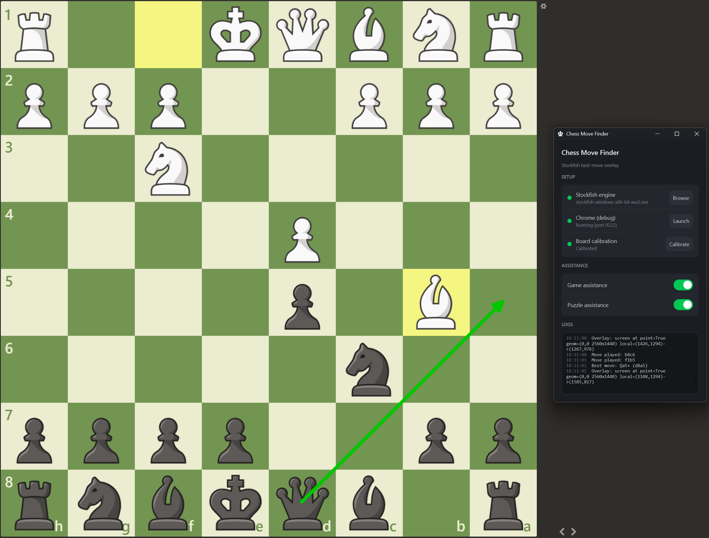

# chess-move-finder

[](https://www.python.org/downloads/)
[](LICENSE)
[](https://github.com/astral-sh/ruff)
[](#requirements)

> Reads your live chess.com **games and puzzles** straight from your own Chrome over
> the DevTools Protocol, and draws the best move as an arrow on a transparent overlay
> on top of the board - driven by Stockfish for games, by the puzzle's own solution
> for puzzles.

<p align="center">
  
</p>

## Description

`chess-move-finder` follows what's happening on chess.com without touching the page
and without automating the browser (no Selenium, no extension, no DOM injection). It
attaches to a Chrome **you** start with remote debugging and only *reads* it:

- **Games** - it listens to the WebSocket moves chess.com already exchanges, rebuilds
  the position, and asks **Stockfish** for the best move whenever it's your turn. It
  works whether you start the tool **before** the game *or* **mid-game**: when the
  move stream can't help yet (your colour wasn't announced, or no frame has arrived
  while it's your turn), it bootstraps from the board's current position.
- **Puzzles** - chess.com delivers the whole solution up front (over an HTTP RPC), so
  **no engine is needed**: the tool tracks your progress on the board and shows each of
  your moves, **step by step**, as you solve.

The arrow lives in a separate transparent, click-through, always-on-top window, so it's
invisible to the page and never interferes with your clicks. The board's on-screen
position is set by a quick **two-corner calibration**, which stays accurate across
multi-monitor setups and fractional display scaling.

A small dark **control panel** (the `--gui` mode) walks you through the setup - pick
Stockfish, launch Chrome, calibrate - each with a status indicator, and only unlocks the
game/puzzle assistance once everything is ready.

> [!WARNING]
> This is a personal/educational project. Using engine assistance during rated or
> competitive online play violates chess.com's fair-play policy and is detectable from
> your move/timing statistics, even though the tool itself is invisible to the page. Use
> it for analysis, learning, or study - not to cheat.

## Requirements

- **Windows** (the overlay relies on Qt's always-on-top / click-through window).
- **Python 3.11+**
- **Google Chrome**
- **Stockfish** - download the UCI binary from
  [stockfishchess.org](https://stockfishchess.org/download/). Needed for game analysis;
  puzzles work without it (their solution is provided by chess.com).

## Installation

```bash
git clone https://github.com/SIIR3X/chess-move-finder.git
cd chess-move-finder
pip install -e ".[dev]"
```

Then edit `config/config.yaml` to point at your binaries (or set the Stockfish path from
the GUI later):

```yaml
engine:
  stockfish_path: D:/tools/stockfish/stockfish-windows-x86-64-avx2.exe
  movetime_ms: 200   # think time per move
  threads: 12        # leave some cores for Chrome/OS
  hash_mb: 512       # transposition table size

chrome:              # used by the GUI's "Launch Chrome" button
  path: "C:/Program Files/Google/Chrome/Application/chrome.exe"
  user_data_dir: "C:/chess-profile"
```

## Usage

Whichever mode you use, the tool attaches to a Chrome started with remote debugging.

### Start Chrome with remote debugging

Chrome 136+ ignores `--remote-debugging-port` on your default profile, so a **dedicated
profile** is required. Close all Chrome windows first, then:

**PowerShell**

```powershell
& "C:\Program Files\Google\Chrome\Application\chrome.exe" --remote-debugging-port=9222 --user-data-dir="C:\chess-profile"
```

**cmd**

```cmd
"C:\Program Files\Google\Chrome\Application\chrome.exe" --remote-debugging-port=9222 --user-data-dir="C:\chess-profile"
```

> The port must match `tracking.port` in `config/config.yaml` (`9222` by default).
> `C:\chess-profile` is a fresh, separate profile created on first launch - **log in to
> chess.com** in it once. Keep the DevTools panel **closed** (only one client can attach
> to a tab at a time, and the app needs that slot).

In `--gui` mode you can also just press the **Launch Chrome** button instead of typing
this command (it uses the `chrome:` section of the config).

### Mode 1 - Control panel (recommended)

```bash
python -m chess_move_finder --gui
```

A small dark window opens with a **setup checklist**, each step showing a status dot:

1. **Stockfish engine** - green once the engine loads. Use **Browse** to pick the binary
   (it's saved to the config and applied live).
2. **Chrome (debug)** - green once Chrome is reachable on the debug port. Use **Launch**
   to start it, or start it yourself with the command above.
3. **Board calibration** - click **Calibrate**, then click the board's **two opposite
   corners** (e.g. top-left and bottom-right squares). The overlay stays blank until you
   do this; press <kbd>Esc</kbd> to keep a previous calibration.

Once all three are green, the **Game assistance** and **Puzzle assistance** switches
unlock - turn on what you want. The log area shows what's happening. Closing the window
quits the app.

### Mode 2 - Console (no window)

```bash
python -m chess_move_finder
```

The classic, minimal flow: it prompts for calibration straight away (click the two board
corners, or <kbd>Esc</kbd> to keep the previous one), logs to the console, and runs with
the assistance settings from `config.yaml`. Quit with <kbd>Ctrl</kbd>+<kbd>C</kbd>.

### Playing

Start a game or open a puzzle on chess.com:

- **Game** - when it's your turn, a green arrow shows Stockfish's best move. Works even if
  you enable the tool **in the middle** of a game.
- **Puzzle** - the arrow shows your next move, advancing **step by step** as you play. It
  resets automatically on each new game/puzzle.

> Set `CMF_DEBUG_FRAMES=1` before launching to also log every raw WebSocket frame (debug).

### Development

```bash
make check   # run lint, type-check and tests (CI equivalent)
make test    # run the test suite
make format  # auto-format and fix lint
```

## Building a Windows executable

Package a standalone app with PyInstaller (run this **on Windows**, since it does
not cross-compile):

```bash
make build
```

The result is in `dist/chess-move-finder/` (ship the whole folder). Double-clicking
`chess-move-finder.exe` opens the control panel directly, and an editable
`config.yaml` is created next to it on first run.

> Stockfish and Chrome are **not** bundled (they are external programs you point at
> via `config.yaml`); only the app and its icon/default config are packaged.

## License

This project is licensed under the [MIT License](LICENSE) (c) 2026 Lucas Fagioli.
